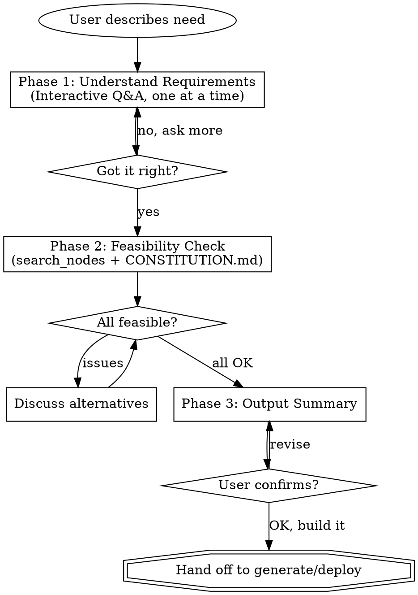

# n8n SDD Requirements Analysis

將自動化想法轉化為嚴謹的規格書，經使用者確認後再建立工作流。

本技能引導使用者（包括零技術背景的初學者）經過結構化的 3 階段流程。目標是理解需求、確認 n8n 可行性、產出完整 spec.md，並在使用者逐項確認後才進入工作流生成。

**重要原則：**
- **所有輸出預設使用繁體中文**（包括 spec.md 內容、對話、註解）
- **spec.md 是工作流生成的前置條件** — 沒有經過確認的 spec.md，不得進入 generate/deploy 階段
- **使用者必須明確確認** spec 內容（特別是 User Stories）後才能繼續

## When to Read Supporting Files

- **CONSTITUTION.md** — Read when you need to check n8n's capabilities and limitations (Phase 2)

---

## Process Overview



---

## Phase 1: Understand Requirements

### Opening

When the user describes an automation need, start with a brief greeting:

> I'll help you figure out what you need and whether n8n can do it.
> Let me ask a few quick questions first.

Then ask questions **one at a time**. Prefer multiple-choice when possible — it's easier for beginners to pick from options than to describe from scratch.

### Core Questions (ask in order, skip if already answered)

1. **What do you want to automate?**
   Understand the specific scenario. If vague, offer examples:
   > For example: "When a customer emails, auto-classify and forward to the right person"
   > Or: "Every morning, pull sales data and send a summary to LINE"

2. **When should it run?**
   - On a schedule (every day at 9am, every hour, etc.)
   - When something happens (new email, form submission, webhook)
   - Manually (click a button)

3. **Where does the data come from?**
   - Google Sheets, Gmail, database, API, form, LINE, etc.

4. **What should happen at the end?**
   - Send notification (LINE, Slack, Email, Telegram)
   - Save data (Google Sheets, database)
   - Call another service (API, webhook)

5. **How often?**
   - Real-time / every X minutes / daily / weekly

### Follow-up Questions (ask when relevant)

These help catch edge cases early, especially for multi-branch workflows:

6. **Are there different cases to handle?** (e.g., different email types get different treatment)
   - This reveals branching logic (If/Switch nodes)

7. **What should happen if something goes wrong?** (e.g., API down, invalid data)
   - This defines error handling strategy

8. **Are there any fields or data you need to map?** (e.g., "the email subject becomes the task title")
   - This clarifies data transformation needs

### Question Guidelines

- One question per message. Wait for the answer before asking the next.
- Use simple language. Say "data source" not "input endpoint".
- When the user mentions a service, note it for Phase 2 verification.
- If the user is unsure, suggest the most common pattern for their scenario.
- Questions 6-8 are optional — ask them when the scenario clearly involves branching, error scenarios, or data mapping. Skip for simple linear workflows.
- After all questions, summarize your understanding and confirm:
  > Let me make sure I got this right: [summary]. Sound correct?

---

## Phase 2: Feasibility Check

### Verification Flow

Use `search_nodes` + CONSTITUTION.md 來驗證每個需求的可行性。這是即時查詢，永遠拿到最新資料。

**步驟：**
1. 對用戶提到的每個服務，呼叫 `search_nodes({query: "服務名稱"})` 確認節點存在
2. 如需確認操作細節，呼叫 `get_node({nodeType: "nodes-base.xxx"})` 查看支援的 operations
3. 參考 CONSTITUTION.md 判斷能力限制（資料量、即時性、AI 需求等）
4. 社群節點也會出現在搜尋結果中（標記 `isCommunity: true`）

### Feasibility Table

Output a clear table:

```
| Requirement | Status | Notes |
|-------------|--------|-------|
| Read Google Sheets | OK | Official node, full CRUD |
| Summarize content | AI needed | Requires AI Agent + LLM |
| Send to LINE | OK | Community node @aotoki |
| Parse PDF attachments | Limited | AI Agent can extract text, not complex layouts |
```

### Status Symbols

| Symbol | Meaning | Action |
|--------|---------|--------|
| OK | n8n fully supports this | Proceed |
| AI needed | Needs AI Agent with LLM | Note LLM provider needed |
| Limited | Possible with workarounds | Explain the limitation |
| Not supported | n8n cannot do this | Suggest alternative or scope reduction |

### AI Agent Detection

Automatically flag as "AI needed" when the requirement involves:
- Understanding or judging content (classification, sentiment)
- Natural language processing (summarization, translation)
- Making decisions based on context
- Conversational interaction
- Processing unstructured data (PDFs, emails, images)

### When Issues Are Found

If any requirement has "Limited" or "Not supported" status, stop and discuss:
- Explain what n8n can and can't do for this specific case
- Suggest alternatives (HTTP Request node for unsupported services, scope reduction)
- Ask if they want to adjust their requirements
- Only proceed to Phase 3 when all requirements are resolved

### Unsupported Service Handling

> This service doesn't have an official n8n node, but there are two options:
> 1. Use the HTTP Request node to call its API directly
> 2. Check if a community node exists
>
> Want me to check if this service has a public API?

### Beyond n8n's Capabilities

> This requirement is outside what n8n handles well. n8n isn't designed for:
> - Complex web UIs (it can do simple forms and webhooks)
> - Real-time streaming (WebSocket)
> - Processing large files (>10MB per operation)
> - ML model training
>
> We could handle the n8n-compatible parts and use an external service for the rest.

---

## Phase 3: 產出 Spec + 確認 + 交接

### Spec 檔案

可行性確認後，產出結構化規格書並**儲存為 `workflows/{name}.spec.md`**。檔名用英文 kebab-case（例如 `daily-sales-report.spec.md`）。

**所有 spec 內容使用繁體中文撰寫。**

### 確認流程（三步驟，不可跳過）

```
Step 1: 展示完整 spec → 請使用者「先讀過一遍」
Step 2: 逐項確認 User Stories → 「這些 User Story 有沒有要修正的？」
Step 3: 整體確認 → 「確認沒問題的話我就儲存並開始建立工作流」
```

**Step 1** — 在對話中展示完整 spec，並明確請使用者閱讀：

> 📋 以下是根據我們討論整理的規格書，請先完整讀過一遍：

**Step 2** — 展示後，**單獨提出 User Stories 請使用者確認**：

> 請特別看一下 User Stories 的部分：
> 1. 作為 {角色}，我希望 {行為}，以便 {價值}
> 2. ...
>
> 這些描述有準確反映你的需求嗎？有沒有要修正或補充的地方？

等使用者回覆後，若有修正就更新 spec 再重新確認。

**Step 3** — User Stories 確認後，詢問整體確認：

> 整份規格書確認沒問題的話，我就儲存到 `workflows/{name}.spec.md` 並開始建立工作流。

### Spec 格式

````markdown
# {專案名稱}

> 產生時間：{YYYY-MM-DD}
> 狀態：待確認 / 已確認

## User Stories

<!-- 至少一個，用使用者的語言寫。每個 story 獨立編號方便回饋。 -->

1. 作為 **{角色}**，我希望 **{自動化行為}**，以便 **{帶來的價值}**。
2. 作為 **{角色}**，我希望 **{自動化行為}**，以便 **{帶來的價值}**。

## 總覽

| 項目 | 說明 |
|------|------|
| **目標** | 一句話描述這個自動化做什麼 |
| **觸發方式** | Schedule / Webhook / Manual / Event-based |
| **資料來源** | Google Sheets / Gmail / API / Form / ... |
| **輸出目標** | LINE / Email / Google Sheets / ... |
| **執行頻率** | 每日 9:00 / 即時 / 每小時 / ... |
| **需要 AI** | 是/否（用途：分類 / 摘要 / ...） |

## 處理流程

<!-- 線性工作流 -->
讀取資料 → 過濾 → 發送通知

<!-- 分支工作流用此格式 -->
接收郵件 → AI 分類
  → 情境 A（報價）：轉發給業務團隊
  → 情境 B（客訴）：建立 Todoist 待辦
  → 預設：封存

## 節點規劃

<!-- 列出預計使用的 n8n 節點，方便後續 generate 階段對照 -->

| 步驟 | 節點類型 | 用途 |
|------|---------|------|
| 1 | Schedule Trigger | 每日 9:00 觸發 |
| 2 | Google Sheets | 讀取銷售資料 |
| 3 | Code | 資料彙整計算 |
| 4 | LINE Messaging | 發送摘要通知 |

## Credentials 需求

<!-- 使用者需事先準備的 API Key 或 OAuth 連線 -->

- [ ] Google Sheets（OAuth2）
- [ ] LINE Messaging API（API Key）
- [ ] Gemini API（API Key）— AI 功能用

## 驗收標準

<!-- 定義「做完了」的標準，後續測試會用這些條件 -->

- [ ] 標準 1：具體可驗證的條件
- [ ] 標準 2：具體可驗證的條件
- [ ] 標準 3：具體可驗證的條件

## 錯誤處理

| 情境 | 處理方式 |
|------|---------|
| 情境 1（例：API 無回應） | 重試 3 次後通知管理員 |
| 情境 2（例：資料格式錯誤） | 記錄錯誤，跳過該筆資料 |

## 備註

<!-- 其他限制、假設、待確認事項 -->

- 限制：（例如 API 呼叫上限）
- 假設：（例如 Google Sheets 已有固定格式）
- 待確認：（例如需要確認 LINE 群組 ID）
````

### 撰寫指引

- **User Stories** 是必填，至少一個。用使用者的語言寫，不要用技術術語。每個 story 編號以方便回饋（「第 2 個 story 要改一下」）。
- **節點規劃** 是新增欄位，列出預計使用的 n8n 節點，讓 generate 階段有明確依據。
- **Credentials 需求** 告訴使用者需要事先準備哪些 API Key 或 OAuth 連線。
- **驗收標準** 定義「做完了」的標準，每條必須是**具體可驗證**的（不接受模糊描述如「運作正常」）。
- **處理流程** 用箭頭標記法，分支用縮排表示。
- **備註** 記錄限制、假設、待確認事項，避免後續踩雷。

### 確認與交接

**使用者確認後：**
1. 將 spec 狀態改為「已確認」
2. 儲存到 `workflows/{name}.spec.md`
3. 若有 n8n-mcp 工具：直接進入 `generate` 或 `deploy` 技能建立工作流
4. 若無 MCP 工具：輸出 spec 供使用者自行建立

**使用者要求修改時：**
- 修改對應段落
- 重新展示修改處
- 回到 Step 2 重新確認

**嚴格規則：spec.md 是工作流生成的必要前置條件。** 在以下情況不得進入 generate 階段：
- spec 尚未產出
- 使用者尚未明確確認 User Stories
- 使用者尚未給出整體確認

Spec 的三重用途：
- **給使用者**：建立前的確認檢查點，確保需求正確
- **給 generate 技能**：結構化輸入，指導工作流生成
- **給 test 技能**：驗收標準定義測試內容

---

## Cross-Platform Notes

This skill works across Claude Code, Codex, and Antigravity. The interaction is purely conversational — no platform-specific tools are required for Phase 1-3.

For tool-specific mappings when using MCP in Full mode, see `references/codex-tools.md`.

---

## 核心原則

- **繁體中文優先** — spec.md、對話、所有輸出預設繁體中文
- **一次一個問題** — 不要在一則訊息裡問 3 個問題
- **簡單語言** — 使用者可能零技術背景
- **提供選項** — 選擇題比開放題更適合初學者
- **先驗證再建構** — Phase 2 及早抓出問題，省時省 tokens
- **嚴謹 spec** — spec.md 包含節點規劃、具體驗收標準、錯誤處理、備註
- **使用者必須確認** — 特別是 User Stories，必須經使用者逐項確認才能繼續
- **spec 是前置條件** — 沒有已確認的 spec.md，不得進入 generate 階段
