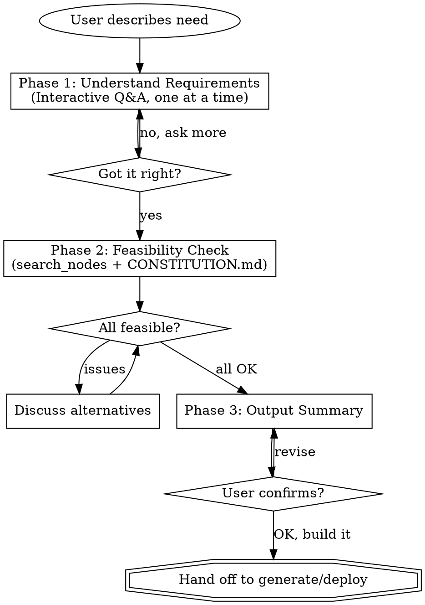

# n8n SDD Requirements Analysis

Turn automation ideas into actionable specs through friendly conversation, then build the workflow.

This skill guides users (including beginners with no technical background) through a structured 3-phase process. The goal is to understand what they want, confirm n8n can do it, and produce a clear summary that feeds directly into workflow generation.

## When to Read Supporting Files

- **CONSTITUTION.md** — Read when you need to check n8n's capabilities and limitations (Phase 2)

---

## Process Overview



---

## Phase 1: Understand Requirements

### Opening

When the user describes an automation need, start with a brief greeting:

> I'll help you figure out what you need and whether n8n can do it.
> Let me ask a few quick questions first.

Then ask questions **one at a time**. Prefer multiple-choice when possible — it's easier for beginners to pick from options than to describe from scratch.

### Core Questions (ask in order, skip if already answered)

1. **What do you want to automate?**
   Understand the specific scenario. If vague, offer examples:
   > For example: "When a customer emails, auto-classify and forward to the right person"
   > Or: "Every morning, pull sales data and send a summary to LINE"

2. **When should it run?**
   - On a schedule (every day at 9am, every hour, etc.)
   - When something happens (new email, form submission, webhook)
   - Manually (click a button)

3. **Where does the data come from?**
   - Google Sheets, Gmail, database, API, form, LINE, etc.

4. **What should happen at the end?**
   - Send notification (LINE, Slack, Email, Telegram)
   - Save data (Google Sheets, database)
   - Call another service (API, webhook)

5. **How often?**
   - Real-time / every X minutes / daily / weekly

### Follow-up Questions (ask when relevant)

These help catch edge cases early, especially for multi-branch workflows:

6. **Are there different cases to handle?** (e.g., different email types get different treatment)
   - This reveals branching logic (If/Switch nodes)

7. **What should happen if something goes wrong?** (e.g., API down, invalid data)
   - This defines error handling strategy

8. **Are there any fields or data you need to map?** (e.g., "the email subject becomes the task title")
   - This clarifies data transformation needs

### Question Guidelines

- One question per message. Wait for the answer before asking the next.
- Use simple language. Say "data source" not "input endpoint".
- When the user mentions a service, note it for Phase 2 verification.
- If the user is unsure, suggest the most common pattern for their scenario.
- Questions 6-8 are optional — ask them when the scenario clearly involves branching, error scenarios, or data mapping. Skip for simple linear workflows.
- After all questions, summarize your understanding and confirm:
  > Let me make sure I got this right: [summary]. Sound correct?

---

## Phase 2: Feasibility Check

### Verification Flow

Use `search_nodes` + CONSTITUTION.md 來驗證每個需求的可行性。這是即時查詢，永遠拿到最新資料。

**步驟：**
1. 對用戶提到的每個服務，呼叫 `search_nodes({query: "服務名稱"})` 確認節點存在
2. 如需確認操作細節，呼叫 `get_node({nodeType: "nodes-base.xxx"})` 查看支援的 operations
3. 參考 CONSTITUTION.md 判斷能力限制（資料量、即時性、AI 需求等）
4. 社群節點也會出現在搜尋結果中（標記 `isCommunity: true`）

### Feasibility Table

Output a clear table:

```
| Requirement | Status | Notes |
|-------------|--------|-------|
| Read Google Sheets | OK | Official node, full CRUD |
| Summarize content | AI needed | Requires AI Agent + LLM |
| Send to LINE | OK | Community node @aotoki |
| Parse PDF attachments | Limited | AI Agent can extract text, not complex layouts |
```

### Status Symbols

| Symbol | Meaning | Action |
|--------|---------|--------|
| OK | n8n fully supports this | Proceed |
| AI needed | Needs AI Agent with LLM | Note LLM provider needed |
| Limited | Possible with workarounds | Explain the limitation |
| Not supported | n8n cannot do this | Suggest alternative or scope reduction |

### AI Agent Detection

Automatically flag as "AI needed" when the requirement involves:
- Understanding or judging content (classification, sentiment)
- Natural language processing (summarization, translation)
- Making decisions based on context
- Conversational interaction
- Processing unstructured data (PDFs, emails, images)

### When Issues Are Found

If any requirement has "Limited" or "Not supported" status, stop and discuss:
- Explain what n8n can and can't do for this specific case
- Suggest alternatives (HTTP Request node for unsupported services, scope reduction)
- Ask if they want to adjust their requirements
- Only proceed to Phase 3 when all requirements are resolved

### Unsupported Service Handling

> This service doesn't have an official n8n node, but there are two options:
> 1. Use the HTTP Request node to call its API directly
> 2. Check if a community node exists
>
> Want me to check if this service has a public API?

### Beyond n8n's Capabilities

> This requirement is outside what n8n handles well. n8n isn't designed for:
> - Complex web UIs (it can do simple forms and webhooks)
> - Real-time streaming (WebSocket)
> - Processing large files (>10MB per operation)
> - ML model training
>
> We could handle the n8n-compatible parts and use an external service for the rest.

---

## Phase 3: Output Summary + Handoff

### Summary Format

After feasibility is confirmed, produce a structured summary. Use the branching notation for multi-path workflows.

```
## Requirements Summary: {Project Name}

- **Goal**: [one sentence describing what this automation does]
- **Trigger**: Schedule / Webhook / Manual / Event-based
- **Data Source**: Google Sheets / Gmail / API / Form / ...
- **Processing**:
  [For linear workflows]
  Read data -> Filter -> Send notification
  [For branching workflows, use this notation]
  Receive email -> AI classify
    -> Case A (quote): Forward to sales team
    -> Case B (complaint): Create Todoist task
    -> Default: Archive
- **AI Needed**: Yes/No (purpose: classification / summarization / ...)
- **Output**: LINE / Email / Google Sheets / ...
- **Frequency**: Daily 9:00 / Real-time / Every hour / ...

### Credentials Needed
- [ ] Google Sheets (OAuth2)
- [ ] LINE Messaging API (API Key)
- [ ] Gemini API (API Key) — for AI features

### Acceptance Criteria
- [ ] Criterion 1
- [ ] Criterion 2
- [ ] Criterion 3

### Error Handling
- If [situation 1] -> [how to handle]
- If [situation 2] -> [how to handle]
```

The "Credentials Needed" section is important — it tells the student exactly what API keys or OAuth connections they need to set up before the workflow can run.

### Confirmation and Handoff

Present the summary and ask:
> Does this look right? If yes, I'll start building the workflow.

When the user confirms:
- If n8n-mcp tools are available: proceed to invoke the `generate` or `deploy` skill to build the workflow directly
- If no MCP tools: output the summary for the user to take to their workflow builder

The summary serves double duty:
- **For the student**: a checkpoint to confirm understanding before building
- **For the instructor**: a window into the student's requirements thinking

---

## Cross-Platform Notes

This skill works across Claude Code, Codex, and Antigravity. The interaction is purely conversational — no platform-specific tools are required for Phase 1-3.

For tool-specific mappings when using MCP in Full mode, see `references/codex-tools.md`.

---

## Key Principles

- **One question at a time** — never ask 3 questions in one message
- **Simple language** — the user may have zero technical background
- **Offer choices** — multiple choice is better than open-ended for beginners
- **Verify before building** — Phase 2 catches issues early, saving time and tokens
- **Lightweight output** — the summary is concise, not a 3-page document
- **Direct handoff** — after confirmation, build immediately without extra steps
